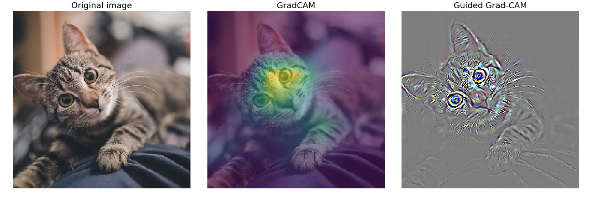

# 🔭 Grad-CAM implemenation in TensorFlow 2.X

>   A TensorFlow 2.X implementation of the various uses of Grad-CAM the original paper, including counterfactual examples and guided Grad-CAM.

## Usage
Notebook provided with step-by-step explanations.

## Requirements
- Python 3.6 or newer
- TensorFlow 2.X
- Matplotlib
- OpenCV

## References
- [Grad-CAM: Visual Explanations from Deep Networks via Gradient-based Localization](https://arxiv.org/abs/1610.02391)
- https://gist.github.com/RaphaelMeudec/e9a805fa82880876f8d89766f0690b54
- https://github.com/jacobgil/pytorch-grad-cam
